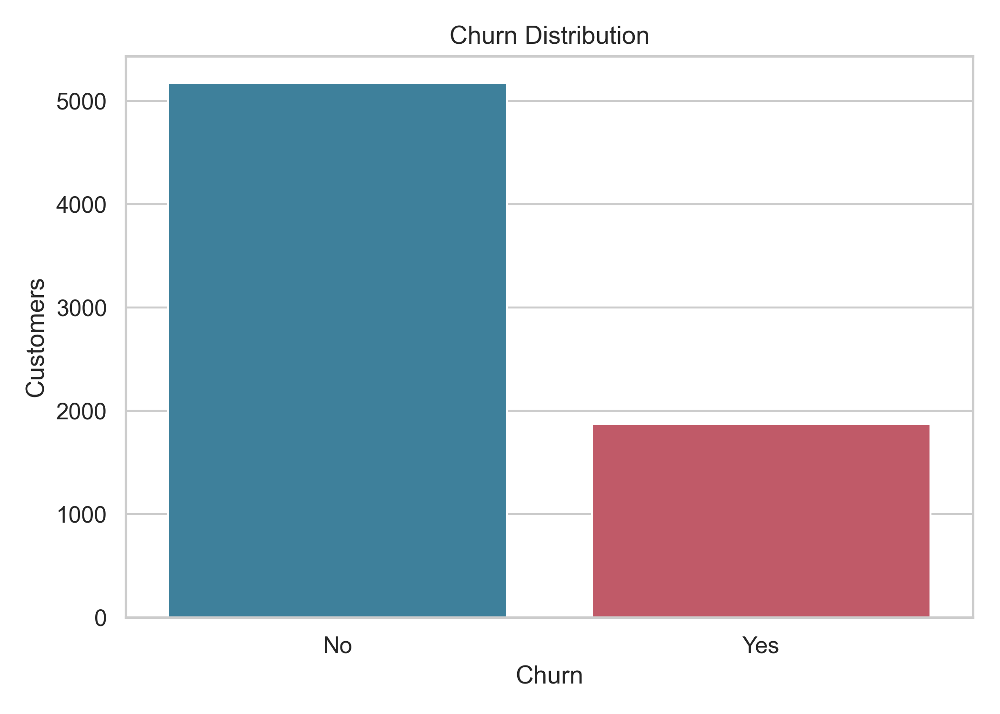
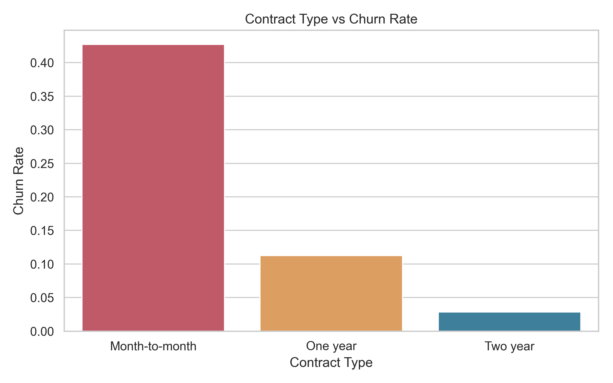
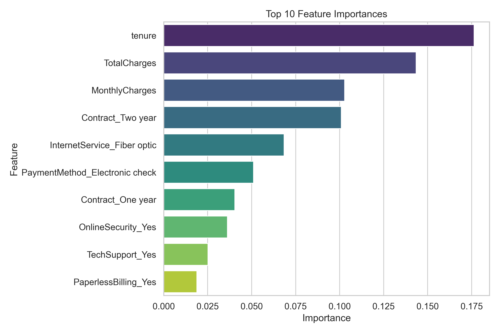
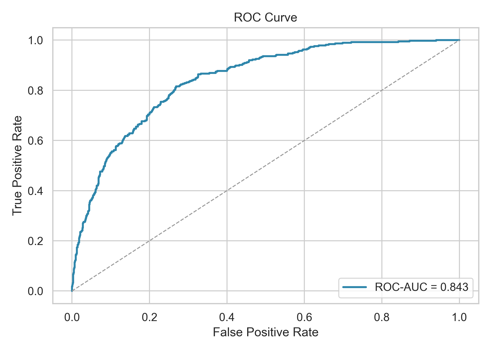

# Customer Churn Prediction

## Project Overview

This project analyzes customer churn risk using the IBM Telco Customer Churn dataset, combining Python machine learning with SQL-based business analysis. The objective is to identify customers at higher risk of churn, understand the business drivers behind that risk, and produce actionable outputs for retention prioritization.

The project is organized as a reproducible Python + SQL portfolio project with source code, notebook analysis, model outputs, visualizations, a standalone SQL analysis layer, and ranked high-risk customers.

## Business Problem

Customer churn creates direct pressure on recurring revenue, customer lifetime value, and retention planning. For a telecom business, understanding churn risk by contract type, tenure, and billing profile helps teams prioritize outreach before customers leave.

This project focuses on three practical questions:

- Which customers are more likely to churn?
- What customer, contract, billing, or service features are associated with churn?
- How can model outputs and SQL segmentation be translated into retention-oriented business actions?

## Dataset Description

The dataset provides customer-level churn, contract, tenure, and billing attributes that support both predictive modeling and business segmentation.

Key fields include:

- `customerID`
- `tenure`
- `Contract`
- `MonthlyCharges`
- `TotalCharges`
- `Churn`

## Tools Used

- Python
- pandas
- scikit-learn
- matplotlib
- seaborn
- Jupyter Notebook
- MySQL
- SQLyog
- SQL scripting

## Workflow

1. Load the Telco customer churn dataset.
2. Clean data fields and prepare the target variable.
3. Explore churn patterns across customer, contract, billing, and service attributes.
4. Engineer model-ready features from categorical and numerical variables.
5. Split the dataset into training and testing sets.
6. Train a Random Forest classification model.
7. Evaluate model performance using classification and ROC-AUC metrics.
8. Analyze feature importance to identify key churn drivers.
9. Rank customers by predicted churn probability.
10. Summarize model findings into business-oriented insights and recommendations.
11. Use the standalone SQL analysis layer to validate churn patterns by contract, tenure, and monthly charge segments.

## Results

The model outputs the following evaluation metrics:

| Metric | Value |
| --- | ---: |
| Accuracy | 0.7686 |
| Precision | 0.5480 |
| Recall | 0.7326 |
| F1 Score | 0.6270 |
| ROC-AUC | 0.8429 |

The ROC-AUC score indicates that the model has useful separation ability between churn and non-churn customers, making it suitable for prioritizing retention strategy rather than replacing business judgment.

The results are saved in `outputs/model_metrics.csv`, and the top 100 highest-risk customers are saved in `outputs/high_risk_customers.csv`. This ranking is the key actionable output: it helps retention teams focus outreach on customers with the highest predicted churn probability, while feature importance and SQL segmentation explain where churn risk is concentrated.

## Visualizations



Business purpose: establishes the baseline churn profile so retention performance and model outputs can be interpreted against the overall churn level.

Decision relevance: helps determine whether churn is a material enough issue to justify targeted retention analysis and customer risk scoring.



Business purpose: compares churn behavior across contract types to reveal how customer commitment relates to retention risk.

Decision relevance: supports contract-focused retention strategies, such as prioritizing month-to-month customers for proactive outreach or upgrade offers.



Business purpose: identifies which variables most influence churn prediction so model behavior can be translated into business drivers.

Decision relevance: helps teams focus retention strategy on areas such as lifecycle stage, billing profile, contract type, and service context.



Business purpose: evaluates how well the model separates churn and non-churn customers across classification thresholds.

Decision relevance: supports threshold selection for retention campaigns where teams must balance outreach volume with churn capture.

## Key Insights

- Month-to-month customers represent a retention priority because flexible contract terms are associated with higher churn risk; this supports targeted upgrade, renewal, or engagement campaigns.
- Short-tenure customers require stronger onboarding and early lifecycle support because churn risk is higher before long-term customer value is established.
- Higher monthly charges may increase churn exposure when perceived value is weak, making pricing communication and service value alignment important retention levers.
- Contract type, tenure, billing, and service-related features should be monitored together because churn risk reflects both customer lifecycle stage and product/service context.
- Ranked churn probabilities turn the model into an operational retention tool by helping teams prioritize outreach instead of treating all customers equally.

## SQL Data Analysis

SQL is implemented as a standalone analysis layer in `sql/churn_analysis.sql`. It is part of the analytical workflow, not just supporting documentation.

The SQL layer supports:

- Customer segmentation by contract type, tenure group, and monthly charge quartile.
- Churn rate analysis for business-readable customer groups.
- Revenue risk identification through higher-risk billing and contract segments.
- Lifecycle analysis using tenure-based customer maturity groups.

Python is used for machine learning, prediction, feature importance, and high-risk customer ranking. SQL is used to validate churn patterns through transparent business segmentation. Together, they create a hybrid workflow where model outputs can be connected back to interpretable customer groups and retention strategy.

## Project Structure

```text
customer-churn-prediction/
|-- data/
|   `-- Telco-Customer-Churn.csv
|-- images/
|   |-- churn_distribution.png
|   |-- contract_churn_rate.png
|   |-- roc_curve.png
|   `-- feature_importance.png
|-- outputs/
|   |-- business_insights.txt
|   |-- model_metrics.csv
|   `-- high_risk_customers.csv
|-- notebook/
|   `-- churn_analysis.ipynb
|-- sql/
|   `-- churn_analysis.sql   # SQL-based business analysis layer
|-- src/
|   `-- churn_prediction.py
|-- requirements.txt
|-- .gitignore
`-- README.md
```

## How to Run

```bash
pip install -r requirements.txt
python src/churn_prediction.py
```
